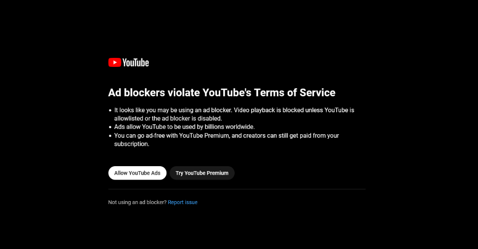
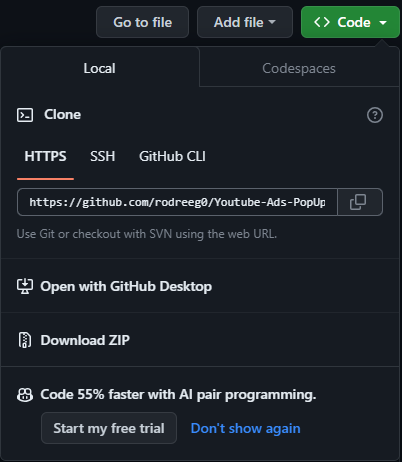
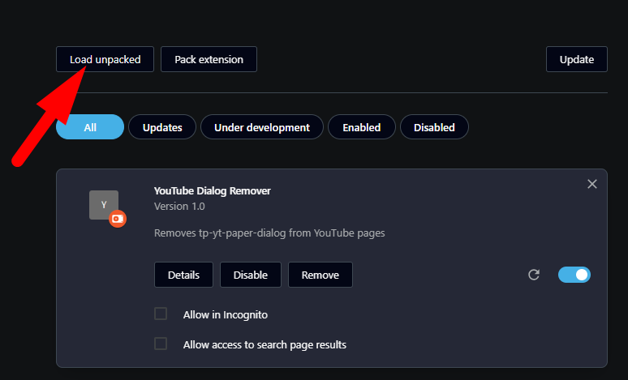

# Youtube-Ads-PopUp-Remover
Youtube is now blocking ads. This is an extension to remove the annoying popup that appears and resumes the video playback automatically.

### Step one

Download or clone this repository. If you download it as zip, don't forget to unzip it.

### Step three
If you're using Firefox [follow the steps explained in the #Installing session](https://developer.mozilla.org/en-US/docs/Mozilla/Add-ons/WebExtensions/Your_first_WebExtension)
For Chrome and Opera go to the extensions page and click on load unpacked and select the folder with the `manifest.json` and `content.js` files.

#### Now enjoy youtube ;)

Buy me a coffe... ☕
`0x53cE5D48030c1623fFF532F6B89080BC2D205323` BSC Network
